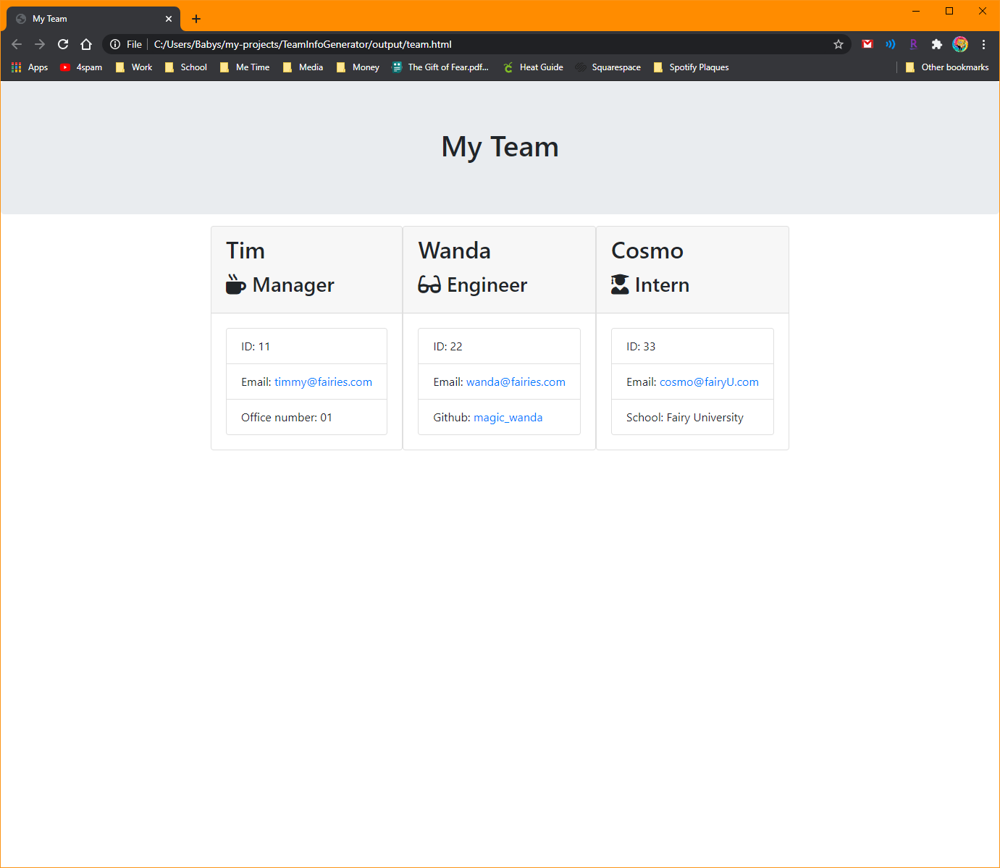

# TeamInfoGenerator
## *Just like Magic*
**Technologies used: Javascript, Node.js, Package.json, HTML**

-------------------------------

Preview a run-through of the generator here : https://drive.google.com/file/d/1VEjOLreCAh2u3C_R9So5e0uJ3WpT0iLh/view

-------------------------------

I spent upwards of 15 hours total studying and reviewing Node.js and classes in order to really understand this assignment. I felt like I had just begun to grasp the basics of Javascript when suddenly so much more functionality and use was added on that it made my head spin. 

Luckily, after a quick study session with some classmates, I was able to really understand the different things going on within the app to make it function. The extends declaration felt so much simpler once I saw and used it repeatedly. It was like function inception, where multiple functions reside within each other and then reverberate all the way to the top. 

After I figured out one extended class, it was easy to duplicate and fill in the rest with their respective distinctions. Asynchronous functions were also easy to understand once I made the connection that they don't follow the line-by-line standard, and arrive "fashionably late" so to speak. 

The program begins by asking to add "another" employee - creating a separate function just so the question would not include "another" in the initialization felt clunky and unnecessary. You can begin by adding any employee in any order, but as the program is currently designed, the employee cards are created in the order the information is provided, so it's recommended you go in descending order. 

The employee function asks for the team member's name, employee or identifaction number, and email address. After that, each team member level has one different additional question. Managers are asked for their office number, Engineers are asked for their github username, and Interns are asked for their school. In addition to the different final questions, each team member type has a different icon. Finally, the github username becomes a link, which leads to a user's actual github page, and the email addresses become a mailto: shortcut for easy access. 

I still feel a little overwhelmed by OOP as a whole, and will definitely spend more time reviewing the concepts and functionality. I like putting notes within code to remind myself what each function does, so that way when I look at it again much later, I'm spending more time reminding myself what the individual variables and arguments are for, instead of reminding myself from scratch.

I definitely feel that I have a hard time starting these assignments, but my classmates, tutor, and instructor really help unlock and apply information that's already in my brain. 

-------------------------------

Screenshot of example team generated using my app : 

Preview a run-through of the generator here : https://drive.google.com/file/d/1VEjOLreCAh2u3C_R9So5e0uJ3WpT0iLh/view